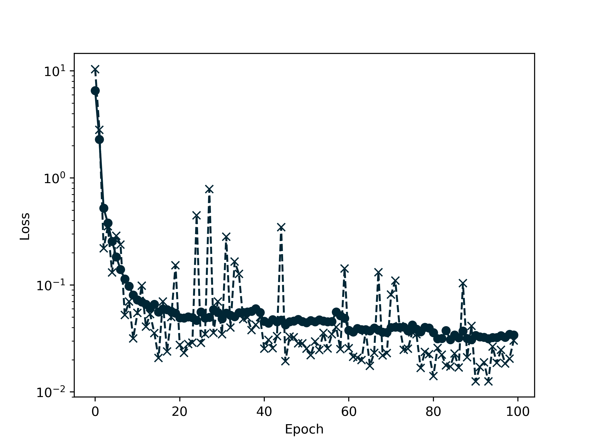
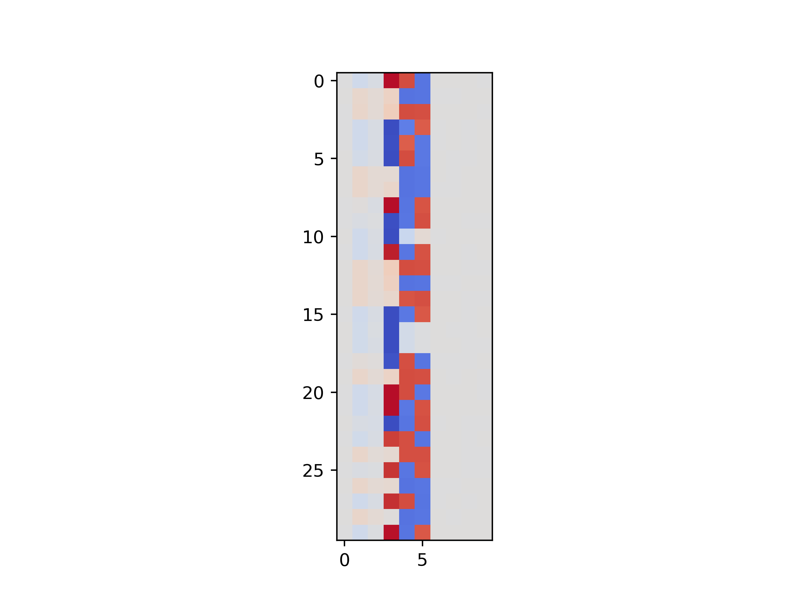
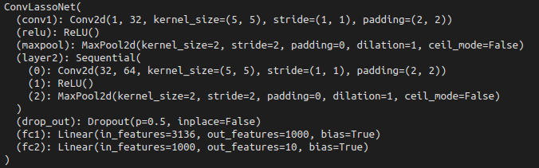
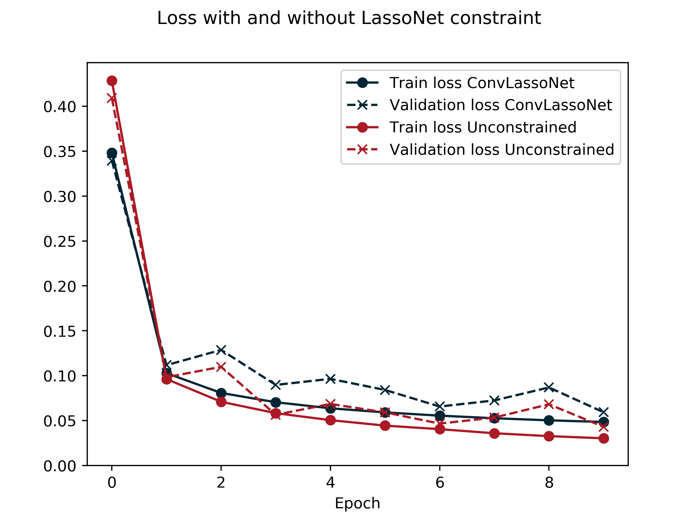
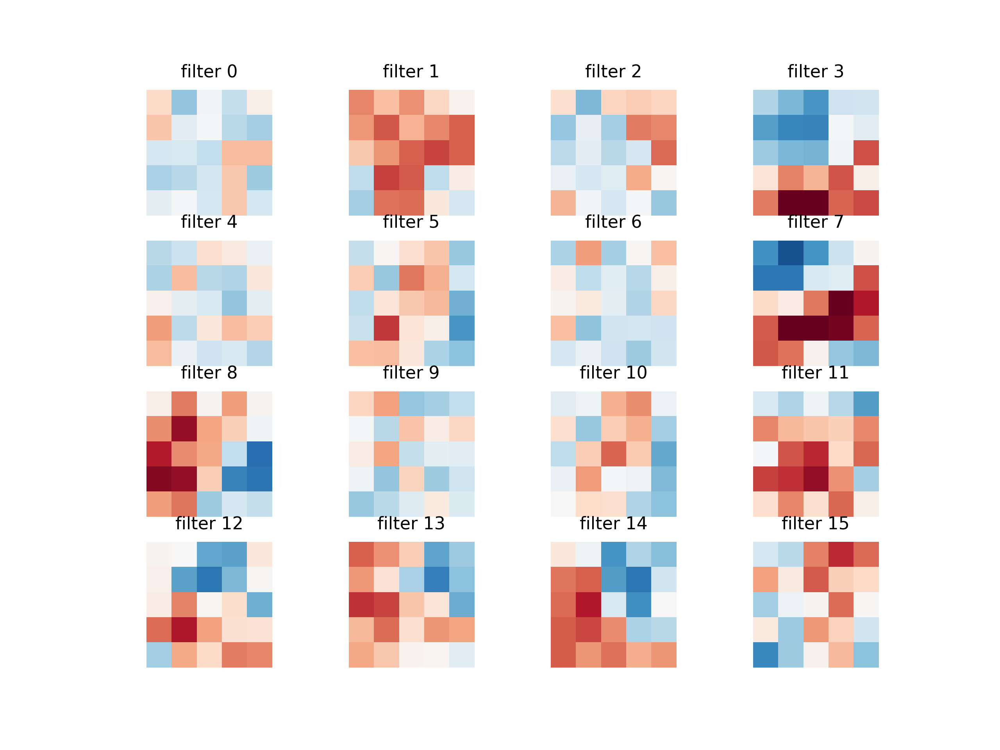
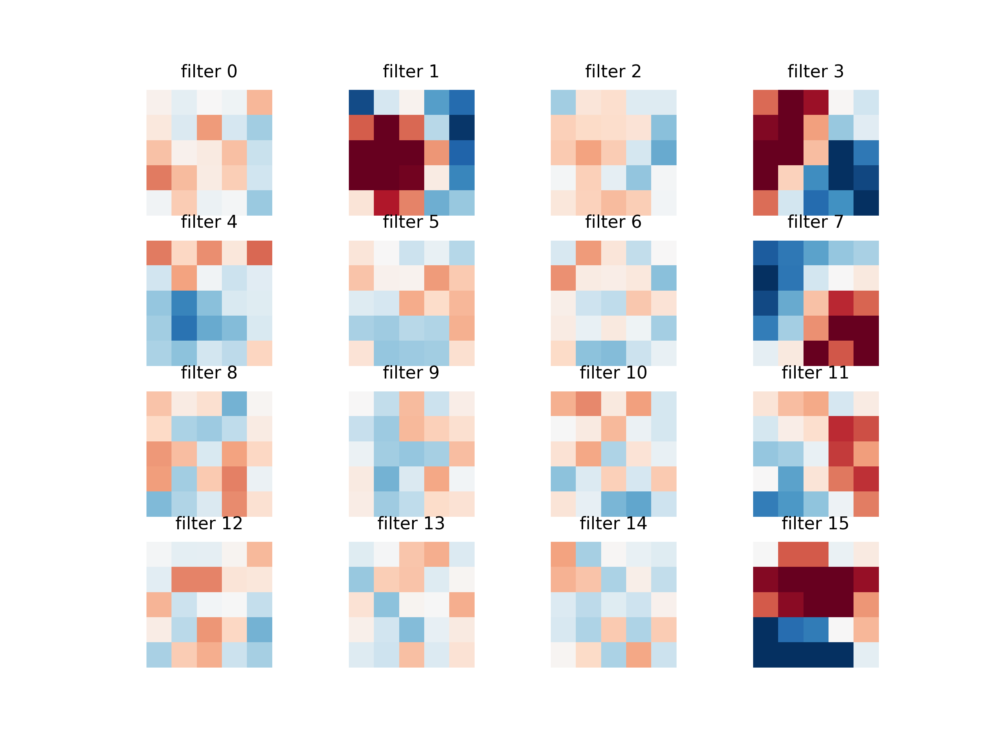
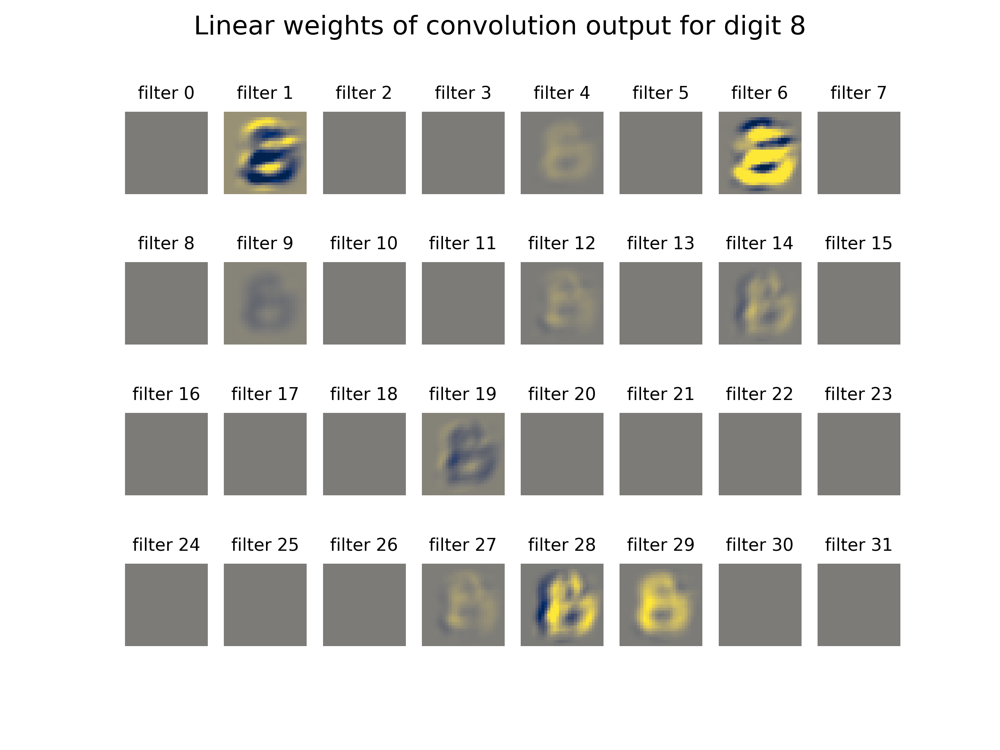

# LassoNet for convolutions

## Introduction

The LassoNet paper (Lemhadri et al., 2021) combines two fundamental ideas of statistical learning: sparse feature selection as in the Lasso and arbitrary nonlinear modelling using (deep) neural networks. The authors of the paper describe it like this:

> Our approach achieves feature sparsity by adding a skip (residual) layer
 and allowing a feature to participate in any hidden layer only if its skip-layer representative
 is active.

## LassoNet problem

I will briefly summarize the mathematical formulation (though looking into the paper provides all the details): let $x\in\mathbb{R}^n, y\in\mathbb{R}^m$ be input and output for a prediction/classification task. We have a neural network $g(x;\omega):\mathbb{R}^n \to \mathbb{R}^m$ where $\omega$ defines the parameters/weights and the linear (aka skip) layer $\theta \in\mathbb{R}^n$. The first layer of $g$ is a linear layer which weight matrix is denoted by $W^{(1)}$ (which is part of $\omega$). LassoNet is then given by

$$   
  \min_{\theta,\omega} L(\theta,\omega) + \lambda \|\theta\|_1 \\
  \text{s.t.} \quad \|W_j^{(1)}\|_\infty \leq M |\theta_j|.
$$

where $\lambda$ and $M$ are given positive parameters. Note that the constraint has the following effect: if feature $j$ is not selected in the skip layer, then $\theta_j=0$ and thus the $j$-th column of $W^{(1)}$ is zero. This means that the $j$-th feature effectively has no effect for the network.

Importantly, learning the parameters of the network (i.e. the nonlinear model) and the feature selection is done simultaneously by solving the above optimization problem.

### Example

Let's try out LassoNet on a small toy example. We create a dataset with the following true underlying model:

```
def generate_toy_example(N):
    X = torch.randn(N, D_in)  
    y = 2.*X[:, 3] - 1.*X[:, 3]**2 + 1.*X[:, 1] + 0.5*X[:, 2] + 2 * X[:, 4] * X[:, 5]

    return X, y.reshape(-1,1)
```

We have `D_in = 10` input features: the coefficients `X1` and `X2` have a linear effect, `X3` has a linear and a squared effect, and `X4` and `X5` have a nonlinear (but no linear!) effect. Let's see what LassoNet makes out of this. We choose a simple feed-forward architecture:

```
class FeedForward(torch.nn.Module):
    """
    2-layer NN with RelU
    """
    def __init__(self, D_in, D_out):
        super().__init__()
        self.D_in = D_in
        self.D_out = D_out
        
        self.W1 = torch.nn.Linear(D_in, H, bias = True)
        self.relu = torch.nn.ReLU()
        self.W2 = torch.nn.Linear(H, H)
        self.W3 = torch.nn.Linear(H, D_out)
        return
    
    def forward(self, x):
        x = self.W1(x)
        x = self.relu(x)
        x = self.W2(x)
        x = self.relu(x)
        x = self.W3(x)
        return x

```

Now we create a LassoNet model by the following code (the full script for this example is [here](https://github.com/fabian-sp/lassonet/blob/main/example.py):

```
l1 = 6.
M = 1.

G = FeedForward(D_in, D_out)
model = LassoNet(G, lambda_ = l1, M = M, skip_bias = True)

loss = torch.nn.MSELoss(reduction='mean')
```

We train the model and inspect the weights of the skip layer:

```
n_epochs = 100
alpha0 = 1e-3 #initial step size/learning rate

opt = torch.optim.SGD(model.parameters(), lr = alpha0, momentum = 0.9, nesterov = True)
sched = StepLR(opt, step_size = 20, gamma = 0.7)

train_info = model.do_training(loss, dl, opt = opt, lr_schedule = sched, valid_dl = valid_dl, n_epochs = n_epochs, verbose = True)
```



```
Skip layer weights:  tensor([[-5.6988e-04,  1.0155e-02,  4.7277e-03,  9.8471e-02,  8.1668e-02, 8.0918e-02,  9.6753e-06, -9.7709e-05,  1.1145e-04, -3.8136e-04]])

```

We see that the `X4` and `X5` feature (have in mind, its pythonic counting) learned a nonzero weight in the skip layer in order to be able to model the actual non-linear effect. We see that all true features are approximately detected. For `X1` and `X2`, we also have the correct sign of the linear effect. However, in general we can no expect that the skip layer weights converge to the true coefficients (even with infinitely many samples): the reason for this is that the model can learn as well through the non-linear part. 

The feature selection is nicely viualized by plotting the weights of the first layer `W1`:



Of course, this is only the result for a handpicked(/-tuned) pair of `(lambda,M)`-values. But we can already see that LassoNet indeed works in the way it's intended.

### Implementation

The authors of the LassoNet paper also provide a PyTorch implementation of their model. Their code only covers networks with arbitrary linear hidden layers and ReLU activation functions, even though their model is quite flexible in terms of the network architecture (the only restriction is that the network needs a linear layer as first module). Thus, I implemented LassoNet (rather to learn more about PyTorch myself) for any network architecture (starting with a linear layer). The code can be found on [Github](https://github.com/fabian-sp/lassonet).


## Extending to convolutions

So far, the LassoNet constraint was applied directly to the input and is required to start with a linear layer. In modern deep learning, convolutions have proven to be very successful, in particular for image applications. Adapting LassoNet to this setting is adressed in the paper as in the following: 

> For example in computer vision, the inputs are pixels and without perfect registration,
  a given pixel does not even have the same meaning across different images. In this
  case, one may instead want to select visual shapes or patterns. [...] In this setting, it would be 
  desirable to achieve “filter sparsity”, that is, select the most relevant convolutional filters. This
  can improve the interpretability of the model and alleviate the need for architecture
  search. In future work, we plan to achieve this by applying LassoNet to the output of 
  one or more convolutional layers.

### Mathematical formulation

So this is what we will do: we define a network having a convolutional layer in the beginning. We then apply the LassoNet constraint to the *output* of the convolutions. Mathematically, we write $\gamma_j$ for our $j=1,\dots,m$ filter weights (i.e. the number of output channels is $m$). In our example below, we use 5x5 filters, hence $\gamma_j \in \mathbb{R}^{5\times5}$.

The skip layer $\theta$ then can be split up into components $\theta_j$ for each of the filters. Each $\theta_j$ is a matrix of dimension `(output dimension of model)  x (output dimension of filter j)`. For the example below, we have 10 label classes, hence `output dimension of model = 10`, and the filters have output of size `28x28`, hence $\theta_j \in \mathbb{R}^{10\times 28^2}$.

The LassoNet model becomes

$$   
  \min_{\theta,\omega} L(\theta,\omega) + \lambda \|\theta\|_1 \\
  \text{s.t.} \quad \|\gamma_j\|_\infty \leq M \| \theta_j \|_2. 
$$

Note that if a filter output is useful as linear predictor for *some* class, then $\|\theta_j\|_2 \neq 0$ and thus the filter weights are allowed to be non-zero. 


### Example: convolutional LassoNet with MNIST

We use the MNIST dataset to illustrate how Convolutional LassoNet works. We use a (more or less) standard architecture of two convolutional layers together with MaxPooling, Dropout and Linear layers at the end. We train the same architecture (with the same optimizer) *with and without* the LassoNet constraint (applied to the output of the first convolutional layer). Below is an overview of the architecture (without LassoNet):



We set `M=20` and `lambda=4` which worked well but could be tuned of course. We first plot training and validation loss of the unconstrained model (denoted by *uncon.*) and the one with LassoNet constraint. They are quite similar (so the additional constraint does not impede learning too much), and interestingely the LassoNet seems to have smaller loss during the first epochs.



Next we show the learned filters of the first convolutional layer for the unconstrained model:



Compare this to the learned filters of the ConvLassoNet model:



Clearly, adding the LassoNet constraint leads to filter sparsity but also to a shrinkage effect (similar as the standard Lasso). Finally, we look at the learned weights of the skip layer, now for the digit 8. These show us, for each filter, what the linear effect of the convolution output is with respect to the probability of the image showing the digit 8.



### Implementation details

Essentially, you only need the following additional code in your PyTorch model in order to use LassoNet:

1) Define a skip layer: we map linearly from the output of the convolutions to the output. Note that the output of the convolutions has dimension `out_channels*h_out*w_out` where `h_out, w_out` depend on the hyperparameters of the convolutional kernels.

```
self.skip = nn.Linear(self.out_channels*self.h_out*self.w_out, self.D_out)
```

2) Adapt the `forward`-method: we apply the skip layer and add the result to the result of the remaining nonlinear part at the end.

```
z1 = self.skip(out.reshape(-1, self.out_channels*self.h_out*self.w_out))
```

3) Defining a prox method which is executed after `.step()` in the training process. This changes the weights of the convolutional filters and the skip layer inplace. All other parameters are unchanged.

```
def prox(self, lr):
  ... # use the HIER-PROX of Proposition 1 in LassoNet-paper. 
  return  
```